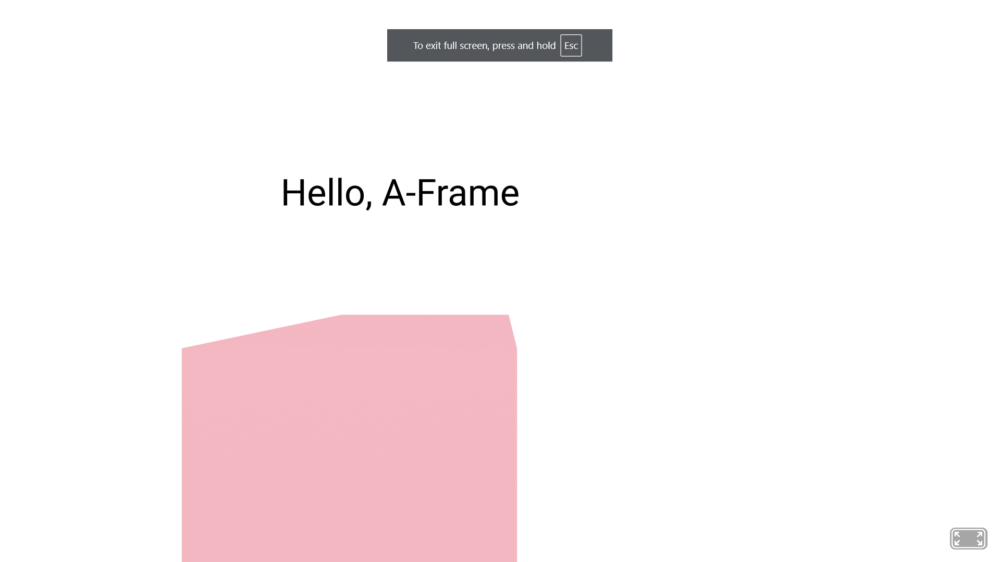

# Entry 5: The ULTIMATE Tool (Personal Finance)
##### 04/11/25

## I made up my mind...

Sadly, [JQuery](https://jquery.com/) was not chosen to be my forever until the very end; [A-Frame](https://aframe.io/) was and is my final choice. Starting on the 4th of March, 2025, I began to tinker with other features A-Frame offered because I've already learned the basics of A-Frame: `entity`, their `position`, `rotation`, `color`, and `scale` (**Shown in [Entry 4](entry04.md)**). Anyways, let's begin...

**Here's a TL;DR list of what I've learned**

MUST READ->(Don't worry; I will be doing a full breakdown after this. Also I am only going to be covering NECESSARY ones, not easy ones; easy ones as in literally inputting texture or a already built background.)

**TOP 4:**

1) Creating a Custom Background
2) Animating an Entity(s)
3) Adding Text
4) Creating an Asset

Let's start at 4 to 1 (**It'll make more sense; trust me**)

---
**NOTE:** I LEARNED EVERYTHING ON [A-Frame DOCS](https://aframe.io/docs/1.7.0/introduction/); Every header will have a link to where I learned that specific A-Frame Code, such as the title literally under this message.

### 4. [Creating an Asset](https://aframe.io/docs/1.7.0/core/asset-management-system.html)
Right after creating an `<a-scene>`, create an `<a-asset>` inside the scene.
``` html
<a-scene>
<!-- INSIDE HERE -->
    <a-asset>
        ...
    </a-asset>
    ...
</a-scene>
```

**The Importance:** Instead of conveniently inputting a texture, audio, or videos into `src` attributes, take the time to put all of those into an `<a-asset>`as it can help **preload** what ever you've inputted (**textures, videos, audio etc**).

``` html
<!-- Example: -->

<!-- This would load texture immediately (with asset) -->
<a-scene>
    <a-asset>
        
    </a-asset>
    <a-box id="#shapePattern" scale="2 2 2" position="0 2 -5"></a-box>
</a-scene>

<!-- This would load texture with delay (without asset) -->
<a-scene>
    <a-box src="shape.jpg" scale="2 2 2" position="0 2 -5"></a-box>
</a-scene>
```
---
### 3. [Adding Text](https://aframe.io/docs/1.7.0/guides/building-a-basic-scene.html#adding-text)
Having text in an A-Frame presentation is extremely important so here's a breakdown:
* The main focus, **the text** `text= "value: (input-text);"`

    * You may also add a color -> `color: (given-color);`
    * The width (**NOT IN px; HAS NOT UNIT**) -> `width: (numerical-value);`
    * The text-alignment similar to google doc's (**in a way**) -> `align: (set-alignment);`
    * ALL OF THIS SHOULD EXIST IN THE `text= "(in here)"`

**Code:**
``` html
<!-- In this example, I put the text above the box by using `align: center` and setting their x and z position the same while the text has a higher y value (to put it above).-->
<a-scene>
    <a-box position="-0.9 0.2 -3" scale="2 2 2" color="pink"></a-box>
    <a-entity text="value: Hello, A-Frame; color: #000000; width: 5; align: center"
    position="-0.9 2.4 -3"
    scale="1.5 1.5 1.5">
    </a-entity>
</a-scene>
<!-- IMPORTANT: text is an entity so it can have a position, rotation, color, and scale -->
```

**Output:**



---
### 2. [Animating an Entity](https://aframe.io/docs/1.7.0/guides/building-a-basic-scene.html#adding-animation)
Imagine random shapes moving in an A-Frame presentation. Wouldn't that be cool or dynamical? That's why animation is #2.

**Breakdown:**
* `animation="property: object3D.position.x` = specify the object being animated
* `to: (numerical-value)`= distance object will travel based on position (**position.x or y**) (negative values move left, positive values move right).
* `dir: (direction-value)` = direction of object's movement
* `dur: (numerical-value)` = duration of animation (**in milliseconds**)
* `loop: (true-false)` = to loop animation

**Code:**

``` html
<a-scene>
  <a-box src="textures/wood.jpg" position="0 2 -5" scale="2 2 2" animation="property: object3D.position.x; to: 10; dir: alternate; dur: 1000; loop: true;"><a-box>
</a-scene>
```

**Output:**

https://github.com/user-attachments/assets/e2a6bd95-7846-4a49-8e67-36c986056e5a

---
### 1. [Creating a Custom Background](https://aframe.io/docs/1.7.0/guides/building-a-basic-scene.html#creating-a-custom-environment-optional)
This is a no brainer; this is most important as it is basically combining everything we've learned onto an A-Frame presentation but with a little extra steps.

**Breakdown:**

* `<a-sky>` + `color="..."` or `src="..."` gives the sky a color or if `src`, gives sky a texture or video or audio; depends on what file you put in there or whatever you put in `<a-asset>`. **Same applies for the steps that are below.**

* `<a-plane>` + `rotation= "-90 0 0"` <-- (**Note: this rotation configuration is default for ground**) + `color="..."` or `src="..."`  + `width="..."` + `height="..."` (**NOT IN "px", just numbers with no unit**)

    * Add `repeat="10 10"` if width and height is 100. If more, set increase both values of `repeat="v1 v2"` to your liking (**APPLIES TO GROUNDS WITH TEXTURES, COLOR**). `repeat` repeats the applied textures across an entity; pattern.

* `<a-light>` (**Create two separate ones; The order doesn't matter**)

    * First `a-light`, give it a `type= "ambient"` (**applied to all**) + `color="..."` (**NO TEXTURE NEEDED FOR `a-light`**)

    * Second `a-light`, give it a `type= "point"` (**light bulb**) + `intensity= "(numerical; no unit)"` + `position="x y z"` <-- (**in numerical; no unit**)

**Code:** LET'S PUT EVERYTHING TOGETHER, INCLUDING THE BASICS AND THE PREVIOUS.

``` html
<a-scene>
    <a-assets>
        
        
        
        
        
    </a-assets>
    <a-light type= "ambient" color= "#0000ff"></a-light>
    <a-light type= "point" position= "0 0 0" intensity= "1" ></a-light>
    <a-sky src= "#galaxyTexture"></a-sky>
    <a-plane src= "#grassTexture" rotation= "-90 0 0" width= "100" height= "100" repeat="10 10"></a-plane>
    <a-cylinder src= "#logTexture" width= "3" height= "10" position= "0 2 -8"></a-cylinder>
    <a-sphere src= "#autumnleavesTexture" scale= "3 3 3" position= "0 7 -8"></a-sphere>
    <a-sphere src= "#ufoTexture" position="-400 200 -300" scale="25 2 25" animation="property: object3D.position.x; to: 400; dir: alternate; dur: 5000; loop: true;"></a-sphere>
    <a-entity text="value: LOOK, THERE'S A UFO IN THE SKY!!!; color: #FFFFFF; width: 5; align: center" position="0 2 -5" scale="1.5 1.5 1.5"></a-entity>
<a-scene>
```

**Output:**

https://github.com/user-attachments/assets/1f5b045f-8fb3-43e6-a37e-f1c51b8f2290

## Engineering Design Process (EDP)

Objectively, I am still in STEP 3.5; same as said in [Entry 4](entry04.md): Not planning the MOST promising solution or brainstorming possible solutions as I've completed that long ago. Personally, I am at basically at Step 4 for EDP because behind the scenes, A-Frame has inspired me to think of a way to display my hardware **DroidNosMoney**. I've been thinking about it for weeks to be honest and *my current plan is to create a mini simple simulation of what my hardware does: explaining the importance of personal financing for teenagers and long term impacts*. That's all for now.

## Skills
It's almost been 2 months... Let's get this over with (**It's currently 12 in the morning**)

### Creativity
I feel like it's a very niche choice because why would I be choosing this when I am already somewhat creative? Well I've "improved" in a way (**I don't know how someone can improve creativity**). Earlier, when I was sharing about how I am personally at the 4th step of EDP? A-Frame helped me grow more creative and not the cliche "creative", rather I had more of a clear choice that I felt would make most sense and be presentable to the audience. I guess it would still be called creativity but anyways, A-Frame is just so interesting and what I mean is the close resemblance to a game and if you know me, I love games. I'm guessing that this is why my brain worked overtime to make me more "creative" because A-Frame is looks like a game (**I'm not only saying this for the words, I like A-Frame for some reason; A little too much**).

### Consideration
This would actually make sense if you were reading about what I wrote earlier (**Hint:** something to do with teenage personal financing). Consideration was created from creativity which initially stemmed from **A-FRAME**. Essentially, A-Frame helped me create a plan in my mind about teenage personal finance (**CREATIVITY**) and if I consider the financial situation of teenagers, that's **CONSIDERATION!!!** On a real note, I actually care about the teenagers' who struggle with managing their money or anybody who struggles with it because I know how it feels to spend $100 on a headphone that broke in 3 days (**Apparently, it was used already but the seller cleaned it to make it look new. I'm so dumb for that**). So besides consideration being created from creativity, I have true empathy for those who are in a financial unstable situation.

### Communication
My improvement in communication has to be addressed. Remember how I was partnered with Winnie C. (**Shown in [Entry 4](entry04.md)**). Communication was minimal but enough, however, when there was the SHABR project a few week ago, that was a different story. Me and my partner, Tina X., interacted and communicated much more and much more effectively. We were discussing what font would fit what during the day of Beyond MVP features (**basically the last day to work on the project**). She told me if the font fit and I offered her some of the other choices I had, and so at the end of the day, there were a lot of back and forth. To be honest, me and Tina are amazing at communicating as partners and that's why we finished our project on time and polished it to the best of our ability.

## Next Step

There is no **"Next Step"** yet. What can be a "Next Step" can be thinking about other ideas to implement and showcase in A-Frame in the context of personal financing. *Maybe a robot that moves and interacts with the user or maybe a video with audio, showcasing me doing some type of demostration with my money.* All those are on my roster of ideas and **I am excited to implement these ideas into A-Frame!**

[Previous](entry04.md) | [Next](entry06.md)

[Home](../README.md)
