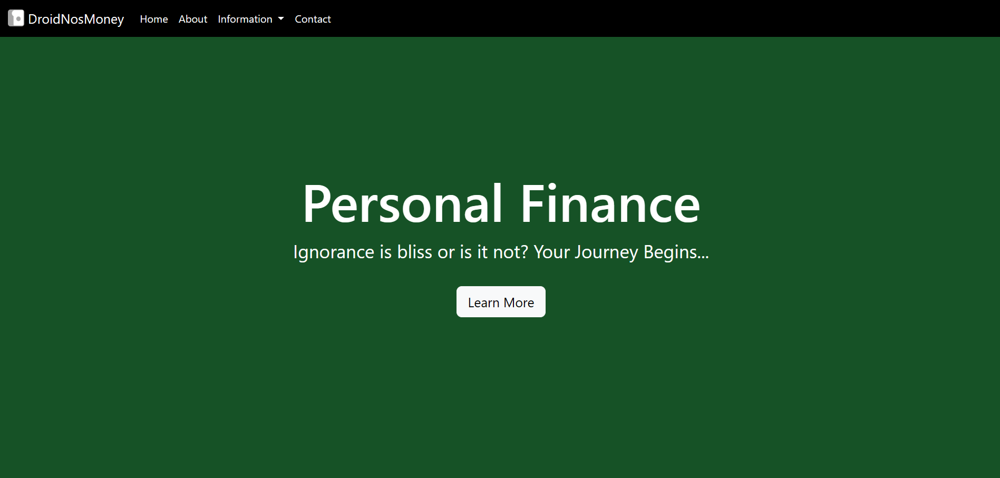
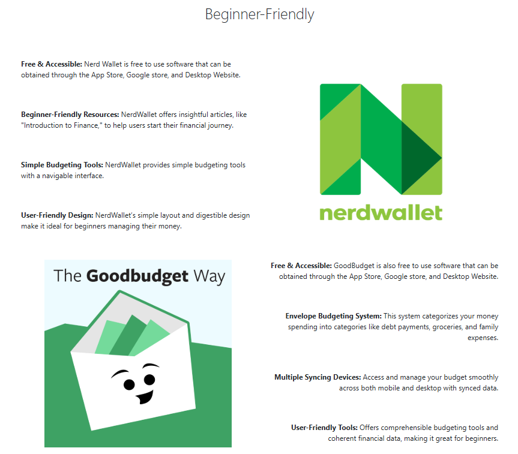
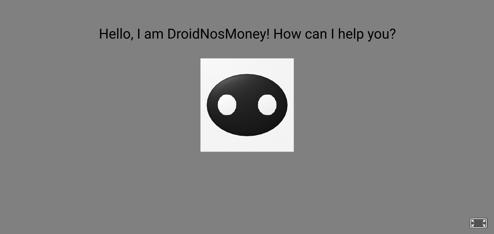

# Entry 6: MVP Webpage (Personal Finance)
##### 5/7/25

## I kept it simple, for now...
**FINALLY!** We're here after a long time **(7 months to be exact)**. CREATING MY WEBPAGE FOR SOMETHING I AM PASSIONATE ABOUT: Personal Finance. Enough celebrating because this isn't the end of my journey; *work now, celebrate later.*

For some context, I am working on draft, **not finalizing my webpage** in one run or in other words, this is called a MVP **(Minimum Viable Product)**.

### BLUEPRINT (Wireframe)
* [Wireframe for desktop #1](../prep/wireframes/wireframe_desktop_1.png)
* [Wireframe for desktop #2](../prep/wireframes/wireframe_desktop_2.png)
* [Wireframe for mobile #1](../prep/wireframes/wireframe_mobile_1.png)
* [Wireframe for mobile #2](../prep/wireframes/wireframe_mobile_2.png)

## Parts of the MVP
Note: the code examples are just the **IMPORTANT** parts of the code. **ADDITIONALLY, I AM NOT GOING TO BREAK EVERYTHING DOWN ABOUT THE MVP, ONLY SIMPLE FUNDAMENTALS**

---
### The Home Section (my favorite part and the one I had NO challenges for, unless you are talking about debugging)


This is my favorite section because it looks satisfyingly simple, especially the green part. Additionally, the Navbar's black color blends so well with the green.

**For the Navbar, I copied and pasted the navbar template from [Bootstrap](https://getbootstrap.com/docs/5.3/components/navbar/#:~:text=Here%E2%80%99s%20an%20example%20of%20all%20the%20sub%2Dcomponents%20included%20in%20a%20responsive%20light%2Dthemed%20navbar%20that%20automatically%20collapses%20at%20the%20lg%20(large)%20breakpoint.)**
* I edited the id and name for each `nav-link` to my preference (e.g, **`#home`/ home** or **`#about`/ about**)
* I added `fixed-top` class to the `nav` and removed `bg-body-tertiary` so that I can use `style.css` to style the color of my navbar: Black.

**For the 'Green Section', I designed it myself (easiest, had no trouble)**
* I used `padding`, `container`, and `d-flex justify-content-center` to create the structure of this section

``` html
<style>
    /* WORKS IF YOU REMOVE THE `bg-body-tertiary` */
    nav {
        background-color: #000000;
    }
    /* padding for the green section */
    .home-section {
        background-color: #165226;
        padding: 16em;
    }
</style>

<!-- NAVBAR -->
<nav class="navbar navbar-expand-lg fixed-top">
    ...
    <ul class="navbar-nav me-auto mb-2 mb-lg-0">
        <!-- nav-links -->
        <li class="nav-item">
            <a class="nav-link" aria-current="page" href="#home">Home</a>
        </li>
        <li class="nav-item">
            <a class="nav-link" href="#about">About</a>
        </li>
    </ul>
</nav>

<!-- GREEN SECTION -->
<header class= "container-fluid home-section" id="home">
    <!-- Container is used to box and center things -->
    <div class="container">
        <!-- d-flex justify-content-center is basically align center -->
        <h1 class="d-flex justify-content-center text-white resp-title">Personal Finance</h1>
        <p class="text-center d-flex justify-content-center text-white resp-desc">Ignorance is bliss or is it not? Your Journey Begins...</p>
        <div class="d-flex justify-content-center">
        <a href="#about" class="btn btn-light btn-lg mt-3">Learn More</a>
    </div>
</header>
```

### Information-Packed Sections

I kept it with a simple and organized order for the information-packed sections: **The Left and Right Format**.

**I used alot of `col` and `order` bootstrap classes to organize it like this but it's easier than it seems, just a lot of copy and pasting and editing.**

One challenge I had was that I never knew `order` existed until I researched a way to keep my mobile-first format the same as my wireframe while preserving desktop format based on my wireframe.

**Takeaway: I learned `order` which is EXTREMELY IMPORTANT and saved me a lot of time.**

* Using `order-lg-1` and `order-lg-2` are important in making it left and right because those classes literally mean order something first or second, starting from the left.
* `col-lg-6` and `col-md-12` are used for responsiveness; For larger (`lg`) screen sizes, information and image are each taking up half the space in their row thus two in one row. For medium (`md`) or lower screen sizes, the information and image stack on top of each other, each taking up a whole row.

``` html
<div class="container">
    <div class="row">
        <!-- title -->
        <h2 class="text-center ex-title-spacing display-6">...</h2>
        <!-- image #1 / first part -->
        <div class="col-lg-6 col-md-12 order-lg-2 text-center">
            
        </div>
        <!-- information #1 -->
        <div class="col-lg-6 col-md-12 order-lg-1">
            <div class="spacing-bottom">
                <p>...</p>
                <p>...</p>
                <p>...</p>
                <p>...</p>
            </div>
        </div>
    </div>
    <div class="row ex-spacing">
        <!-- image #2 / second part -->
        <div class="col-lg-6 col-md-12 text-center">
            
        </div>
        <!-- information #2 -->
        <div class="col-lg-6 col-md-12">
            <div class="spacing-bottom text-lg-end">
                <p>...</p>
                <p>...</p>
                <p>...</p>
                <p>...</p>
            </div>
        </div>
    </div>
</div>
```
### Preview of Hardware ([A-Frame](https://aframe.io/))

### ↓


Pretty plan preview section and scene but it's something. I am planning to improve this via embedded scene instead of linking it.

**I created a section with a title and a button underneath it that links it to the A-Frame scene via href. The A-Frame Scene uses the basic entity/ shapes to form the model shown above including:**

One challenge I had for this was how to use `scale` and what does its values mean `(x y z)`. Eventually I figured out that x = width, y = height, z = length via **[A-Frame Scale](https://aframe.io/docs/1.7.0/components/scale.html).**

**Takeaway: I learned what `(x y z)` means for scale.**

* `<a-sky>`: used for background color.
* `<a-box/sphere>`: used for the head **(box)**, face **(sphere)**, and eyes **(sphere)**.
* `<a-entity text>`: used for text simply.

``` html
<!-- Preview section -->
<section class="mb-5">
    <h1 class="display-1 text-center mb-5">PREVIEW OF HARDWARE</h1>
    <div class="row d-flex justify-content-center">
        <div class="col-4">
            <div class="d-grid">
                <!-- Button that links to A-Frame scene -->
                <a class="btn btn-primary" href="aframe_scene.html" role="button">Open Preview</a>
            </div>
        </div>
    </div>
</section>
<!-- A-Frame Scene -->
<a-scene>
    <!-- gray background -->
    <a-sky color="gray"></a-sky>
    <!-- Model design begins -->
    <a-box position="0 2 -6" scale="3 3 3"></a-box>
    <a-sphere position="0 2 -4.5" scale="1.3 1 0.1" color="#141414"></a-sphere>
    <a-sphere position="-0.5 2 -4.5" scale="0.6 0.6 0.1" color="white"></a-sphere>
    <a-sphere position="0.5 2 -4.5" scale="0.6 0.6 0.1" color="white"></a-sphere>
    <!-- Model design ends -->
    <!-- The Greeting Text -->
    <a-entity text="value: Hello, I am DroidNosMoney! How can I help you?; color: #000000; width: 6; align: center"
    position="0 4 -4"
    scale="1.5 1.5 1.5">
    </a-entity>
</a-scene>
```

## Engineering Design Process (EDP)

Objectively and personally, I am done with **Step 5: Create a prototype** of the EDP. Currently, I am on **Step 6: Test and evaluate the prototype** of the EDP but instead of testing the webpage and the very obvious A-Frame scene myself, my fellow classmates will be testing it out and giving me glows and **grows**. This process is important because the more perspectives, the better for the overall final webpage. However, I do have some personal ones like adding shadows to the bottom of my navbar so it has a more "3d" effect.

## Skills
*Hello, How are you?*

### Time Management
This skill is EXCLUSIVELY to Projects **(most of the time)**. The reason is that I had to study for AP World History Exam, while also having a project on SEP and other work I had to get done. So like usual, I had to adapt and when I get use to it, it's because I used Time Management skills to plan out a schedule about what I am going to do for today or tommorow or the day after tommorow etc. For example, on May 2nd, I had a ton of work and some missing assignments I had to finish so I planned something: Do SEP MVP first then finish QCQ, if I had time then on the weekend, finish work in the morning, study AP for a little **(Prevent Cramming)** and I have the rest of the day for my personal life **(I was busy for the weekend)**. As you can see, this is just a common case of Rain being a mature and **organized** young man.

### Organization
So about "organized young man", Yes I also had to adapt to being organized after the camping trip because I realized that I have this to do and that to do. Somewhat similar to time management but instead, I had to reorganize my **plan.md** because I postponed my A-Frame building and some other features. Also recently, I've been creating directories to store images, especially for projects and even the blog I am doing right now. I find it satisfying to store everything into one folder and not have to look at a long list of `.png` image files when I open my project or blog directory. By the way, I just realized that I have been creating image folders semi-consciously and it's funny to think about that I would actually organize my stuff **(You should see my room)**. **Kudos Rain.**

### Debugging
The FP Webpage and code is all you have to know, BYE. I'm joking and I mean when I say this: I have improved so so SO much in debugging code while working on my **FP MVP Webpage.** Once, my sections were in complete shambles because of a `<div>` not rightly indented/ aligned with another `</div>`. I had a eye of an eagle and SOMEHOW, I found it and what made it harder was that everything was mushed together; slim to none spacing between code lines. Another can be when I was trying to fix my navbar dropdown **(It didn't want to open when I clicked on it).** First, I figured out that there was a typo and a mis-indented `<a>`, so I fixed it, but that didn't solve my issue. I searched and in **ONLY** 30 seconds, I found out why: I had 2 `<script>` cdn(s) of bootstrap all the way at the bottom of the code **(They weren't spaced so it only made it more difficult).** I don't know if this is actually debugging but I sure do have an eye of an eagle which I am proud of **(It is debugging, Rain. Good job for you! - Rain).**

## Next Step
The Next Step for EDP is Step 7: Improve as needed. After receiving feedback from my classmates, I'll revise my webpage or the **BEYOND MVP WEBPAGE,** THE BEST ONE WEBPAGE CAN REACH. For example, I'll be changing my navbar color to something else than black or else it won't fit the green theme. *I hope the finalizing process turns out NOT a disaster and I'll see you another time!*

[Previous](entry05.md) | [Next](entry07.md)

[Home](../README.md)
