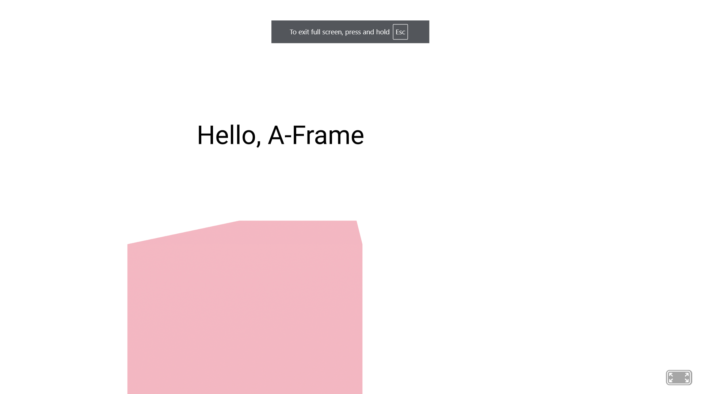

# Tool Learning Log

## Tool: **A-Frame**

### 3/4/25:
* I learned how to change the location/ environment in A-Frame and it was pretty easy. Lets go over the process!
  * I went onto [Bootstrap](https://aframe.io/docs/1.7.0/guides/building-a-basic-scene.html#:~:text=The%20environment%20component%20procedurally%20generates%20a%20variety%20of%20entire%20environments%20for%20us%20with%20a%20single%20line%20of%20HTML.) Environment section (**highlight linked**). I clicked on the *linked* [environment component](https://github.com/supermedium/aframe-environment-component/) (**linked**) and it took me to a short tutorial on how to change my environment.
  ``` html
    <!--Copy and paste into your <head></head> // Note: need latest version of A-Frame-->
    <script src="https://unpkg.com/aframe-environment-component@1.5.x/dist/aframe-environment-component.min.js"></script>
    <!-- Then create a ... -->
    <a-scene>

    </a-scene>
    <!-- Lastly, type in this into the <a-scene></a-scene> -->
    <a-entity environment></a-entity>
  ```
  **Output:**

  

  * The baseplate seems too plain? Here's something to change the landscape!

  ``` html
    <!-- use presets to change your landscape! -->
    <a-scene>
      <a-entity environment= "preset: forest;"></a-entity>
    </a-scene>
  ```
  **Output:**
  

### 3/14/25:
* I learned how to animate an object in A-FRAME!
  * I used
    * `animation="property: object3D.position.x` = specify the object being animated
    * `to: (numerical-value)`= distance object will travel based on position.(x or y).
    * `dir: (direction-value)` = direction of object's movement
    * `dur: (numerical-value)` = duration of animation
    * `loop: (true-false)` = to loop animation

**Code:**

``` html
<a-scene>
  <a-box src="textures/wood.jpg" position="0 2 -5" scale="2 2 2" animation="property: object3D.position.x; to: 10; dir: alternate; dur: 1000; loop: true;"><a-box>
</a-scene>
```

**Output:** A floating cube that moves 10 units to the right (`object3D.position.x`) and coming back to original position (`alternate`); repeats again for infinite amount of times (`loop`). Total duration of animation is 1 second = `1000` millisecond.

### 3/23/25:
* I learned how to add text in A-Frame!
  * This is simple and it works like this:
    * text= `"value: (input-text);"`
      * You may also add `color: (given-color);` in the `text= "(in here)"`
      * A set width -> `width: (numerical-value);`
      * An alignment -> `align: (set-alignment);`

**Code:**
``` html
<!-- NOTE - you can also set a position to it and a scale because it's an <a-entity> -->

<!-- In this example, I put the text above the box by using `align: center` and setting their x and z position the same while the text has a higher y value (to put it above).-->
<a-scene>
    <a-box position="-0.9 0.2 -3" scale="2 2 2" color="pink"></a-box>
    <a-entity text="value: Hello, A-Frame; color: #000000; width: 5; align: center"
    position="-0.9 2.4 -3"
    scale="1.5 1.5 1.5">
    </a-entity>
</a-scene>
```

**Output:**




### 3/30/25
* I learned how to create a simple custom background (**SCB**) through A-Frame!

  * It uses some of the beginner codes of A-Frame (**3-STEP SCB**)

    * `a-sky` + `color="..."` and you'll be set for the first step of your SCB!

    * `a-plane` + `rotation= "-90 0 0"` <-- (**Note: this rotation configuration is default for ground**) + `color="..."` + `width="..."` + `height="..."` (**NOT IN "px", just numbers with no unit**) = second step completed!

    * `a-light` (**Create two separate ones; The order doesn't matter**)

      * First `a-light`, give it a `type= "ambient"` + `color="..."

      * Second `a-light`, give it a `type= "point"` + `intensity= "(numerical; no unit)"` + `position="x y z"` <-- (**in numerical; no unit**) = you're DONE!!!

**Code:**

``` html
<a-scene>
  <a-box color= "green" position= "0 2 -10" scale= "3 3 3"></a-box>
  <a-sky color= "red"></a-sky>
  <a-plane rotation= "-90 0 0" color= "blue" width= "100" height= "100"></a-plane>
  <a-light type= "ambient" color= "#ffffff"></a-light>
  <a-light type= "point" intensity= "2" position= "0 10
    -6"></a-light>
</a-scene>
```

**Output:**


### 4/5/25
* I learned how to set textures on entities and it's simple!

  * Personally, I link the texture without puttin the texture file into an asset, but I'm going to show both ways.

    **Codes:**

    * **Without `<a-assets>`:** quick but on preview, the texture might load in with delay; looks white for a second.

    ``` html
    <a-scene>
      <a-box src="textures/wood.jpg" position="4 2 -8" scale="2 2 2"></a-box>
      <a-sphere src="textures/blue-wood.jpg" position="-4 2 -8" scale="2 2 2"></a-sphere>
    </a-scene>
    ```

    * **With `<a-assets>`:** extra code to write but it's already loaded before you open preview; no loading delay.

    ```html
    <a-scene>
      <a-assets>
          
          
      </a-assets>
      <a-box src="#woodTexture" position="4 2 -8" scale="2 2 2"></a-box>
      <a-sphere src="#bluewoodTexture" position="-4 2 -8" scale="2 2 2"></a-sphere>
    </a-scene>
    ```
    **Output:**


<!--
* Links you used today (websites, videos, etc)
* Things you tried, progress you made, etc
* Challenges, a-ha moments, etc
* Questions you still have
* What you're going to try next
-->
